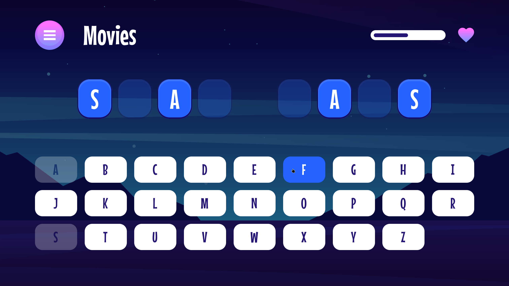

# Hangman game solution (Frontend Mentor)

This is a solution to the [Hangman game challenge on Frontend Mentor](https://www.frontendmentor.io/challenges/hangman-game-rsQiSVLGWn).

## Table of contents

- [Overview](#overview)
  - [The solution](#the-solution)
  - [Screenshot](#screenshot)
  - [Links](#links)
  - [Built with](#built-with)
- [Author](#author)

## Overview

### The solution

Users are able to:

- Learn how to play Hangman from the main menu.
- Start a game and choose a category.
- Play Hangman with a random word selected from that category.
- See their current health decrease based on incorrect letter guesses.
- Win the game if they complete the whole word.
- Lose the game if they make eight wrong guesses.
- Pause the game and choose to continue, pick a new category, or quit.
- View the optimal layout for the interface depending on their device's screen size.
- See hover and focus states for all interactive elements on the page.

### Screenshot

### Links

- Solution URL: [Frontend Mentor](https://your-solution-url.com)
- Live Site URL: [Vercel](https://hangman-game-three-hazel.vercel.app/)

### Built with

- [TypeScript](https://www.typescriptlang.org/) - "JavaScript with syntax for types"
- [React](https://reactjs.org/) - JS library
- [React Router](https://reactrouter.com/)
- Mobile-first workflow
- Semantic HTML5 (JSX) markup
- BEM and OOCSS methodologies in combination
- CSS Grid
- Flexbox

## Author

- Website - [qada.ge](https://qada.ge)
- LinkedIn - [Q4D4](https://www.linkedin.com/in/q4d4/)
- Twitter - [@DavidKadaria](https://www.twitter.com/DavidKadaria)
- Frontend Mentor - [@DavidKadaria](https://www.frontendmentor.io/profile/davidkadaria)
